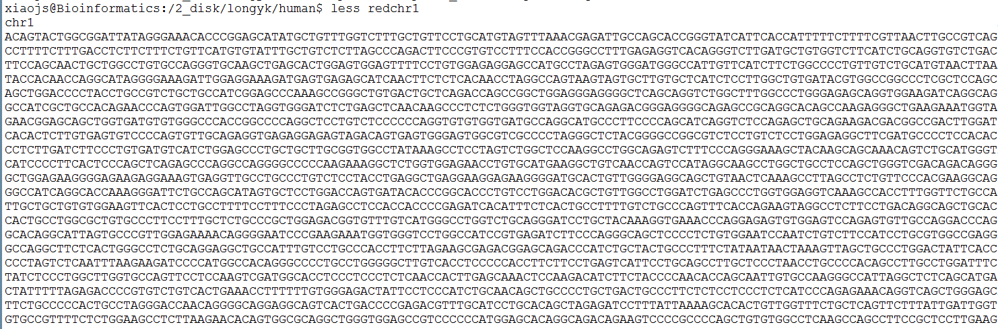
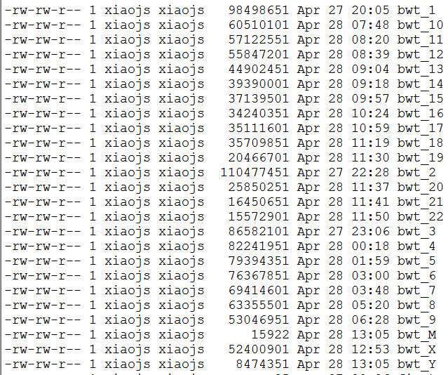
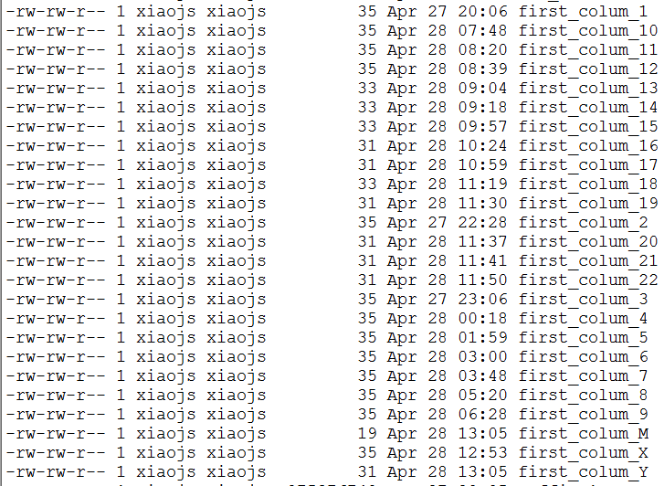
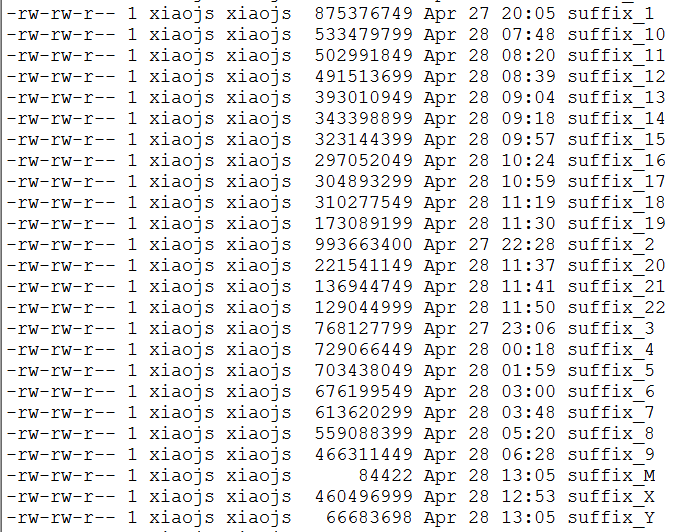
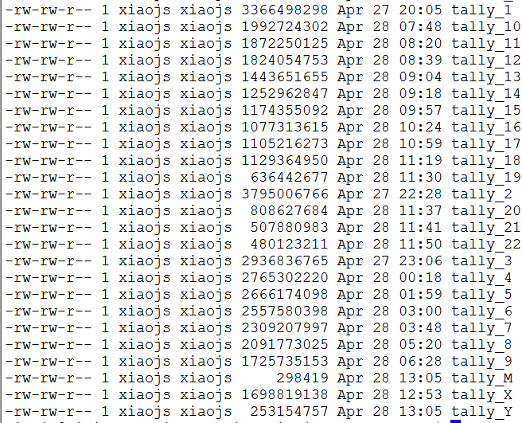
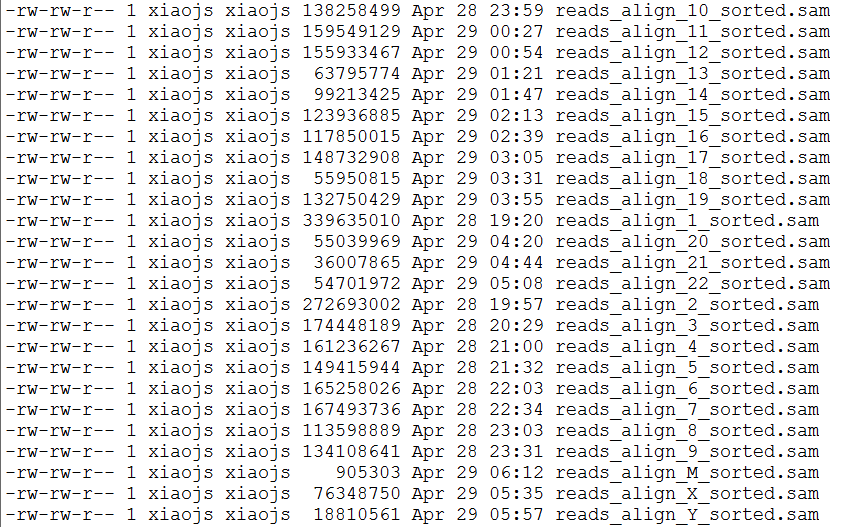

# BWT-sequencing-reads-align
Python implementation of Burrows-Wheeler Transform (BWT) and the Alignment process.
Using bowtie algorithms to map exome sequencing reads to human genome reference and successfully call most mismatches. Allowed read .fq file and output to a .vcf file, allow one mismatch in the alignment, be capable to handle the human whole genome data, all analysis done in 24 hours, No open source software is used.

This is the course project for Bioinformatics(BI3204 2016.02-2016.06) at [SUSTC](http://www.sustc.edu.cn/).

**Table of Contents**

- [Introduction to BWT and alignment algorithms](#Introduction-to-BLAST-and-alignment-algorithms)
- [BWT and Alignment implementation in python: For human genome](#bwt-implementation-in-python:-for-human-genome)
  - [construct library](#construct-library)
  - [sequencing reads alignment algrithms](#alignment-algrithms)
  - [making pileup](#making-pileup)
  - [making vcf](#making-vcf)

## Introduction to BWT and alignment algorithms
I recommend you reading the [BWT-aligner](https://github.com/RodenLuo/BWT-Aligner.git) writer by RodenLuo.

## BWT and Alignment implementation in python: For human genome
### construct library
```bash
perl reduceBase.pl hg19.fa
# As we only focus on exome sequncing reads, thus, we ignore and exclude the 'N' and intron sequence in hg19.fa 
# this wil output 25 files: redchr1, redchr2......................
```


```bash
python construct_library.py hg19.fa
# As introduce before, BWT algrithms need pretreat reference genome to produce first colum, suffix, bwt sequence(last colum), tally.(respectively for each chromosome)
# this will output 25x4 txt file.
```





###sequencing reads alignment algrithms
```bash
python align_reads_sorted.py jiankuihe-exome-1.fq
# jiankuihe-exome-1.fq has 15,000,000 reads totaly. we need align those reads to our reference genome: hg19.fa.
# this will output 25 sam file.
```


chromosome|1|2|3|4|5|6|7|8|9|10|11|12
----------|-|-|-|-|-|-|-|-|-|--|--|--
successful aligned reads|1364494|1094732|700723|647999|600183|663716|672823|456356|538785|538785|638643|624182 

chromosome|13|14|15|16|17|18|19|20|21|22|X|Y|M
----------|--|--|--|--|--|--|--|--|--|--|-|-|---
successful aligned reads|255531 |397424 |496341 |472183 |595685 |224039 |531805 |220418 |144303 |219406 |306813 |75852 |3681 
